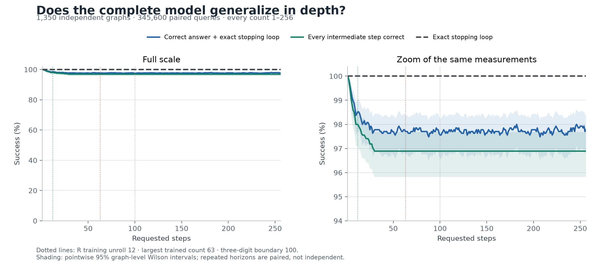
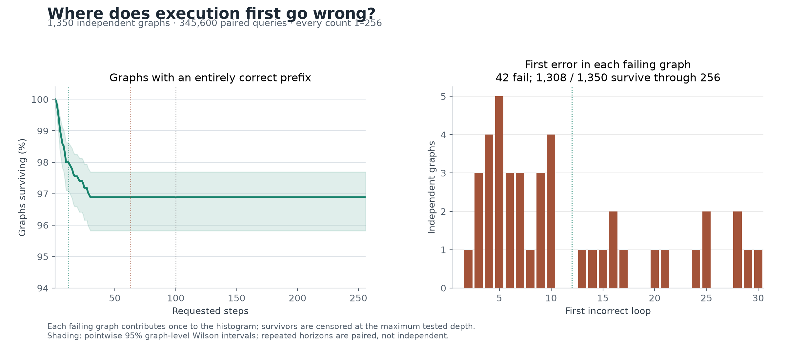

# Final checkpoint full benchmark — 2026-10-08

Status: **completed; all six predeclared quality criteria passed**.
Protocol/config were committed in `f8a14cb` before any result.
The full suite exited successfully; both additional native reference audits passed.

The user requested a direct full benchmark after the shared-reader/countdown
repair. The final checkpoint stayed frozen:
`models/stage1_pointer/controller-shared-number-precision-seed83/best`.
Adapter SHA-256:
`0f8a3f2572ec2caf4fafbcdd074b5283bd8c610602502763b3c04487ce1f123d`.
No fitting, threshold tuning, checkpoint selection, or changed training exposure.

## Protocol and training exposure

Run all 1,536 seed-61 test queries on 128 graphs at depths 1–12 using native
learned-stop inference. This previously opened split is a regression check.
Then generate 1,350 independent graphs: fresh seeds 307/311/313, 150 per seed
and graph mode (random function, permutation, full cycle). Reject tables from
every seed-61 split and both previously opened benchmark panels (seeds
211/223/227 and 281/283/293). Evaluate every integer count 1–256, giving 345,600
paired graph/count queries. All 26-state graphs eventually repeat states.

| Component | Training requests | Maximum supervised recurrent unroll |
| --- | --- | --- |
| Frozen R executor | 1–6, 8, 10, 12; requested 7/9/11 held out | 12 |
| Reader/controller | 1–63 excluding 9/17/29/41/53; 64 unseen | 12 |

The repair added no training graph, count or deeper supervision. R never
received a numeric count or external clock. The trained controller uses raw
Steps-field token embeddings and learned scalar recurrence. Numerical N−t values
are training targets only; no programmed decrement or numeric parser is used.

Use the existing frozen evaluator: count-free executor trajectories reused over
requested counts, independent controller replay, threshold 0.5, safety cap 272,
and the original quality criteria. Execute the original 21 reader-repair native
counts on the first graph in each of nine strata (189 actual stopped calls).
Every native decision must match replay; independently audit every saved
decision against raw graph traversal; verify inference hashes before and after.
Batch size 64 changes execution scheduling only. Native batch-one checks guard
decision fidelity. Bootstrap 2,000 times within seed/mode strata with seed 239;
graphs are the independent sampling unit.

## Results

| Panel / metric | Result |
| --- | --- |
| Existing native test: answer, complete trajectory, exact stopping and joint success | **100%**, 1,536/1,536 |
| Fresh panel: answer plus exact stopping loop, averaged over all counts | **97.81%**, 338,026/345,600 |
| Fresh panel: complete trajectory plus exact stopping, averaged over all counts | **97.02%**, 335,293/345,600 |
| Exact stopping at every requested count 1–256 | **100%**; no early, late or missing stops |
| Final answer and exact stop at depth 256 | **97.78%**, 1,320/1,350 |
| Complete trajectories through depth 256 | **96.89%**, 1,308/1,350 |
| Lowest per-count joint success | **97.48%** |
| Lowest per-count complete trajectory | **96.89%** |
| Correct letter at the wrong loop | **0** |

Overall joint success has graph-cluster bootstrap 95% interval **97.04–98.53%**.
Mean complete-trajectory success has interval **96.14–97.87%**. At depth 256,
marginal graph-level Wilson intervals are **96.85–98.44%** for joint success and
**95.82–97.69%** for complete trajectories. These are not simultaneous guarantees
over all counts. At a fixed integer the controller is graph-independent, so
resampling graphs cannot quantify uncertainty over unseen integers.

| Requested-count cohort | Joint success | Mean complete trajectory | Exact stop |
| --- | --- | --- | --- |
| 1–12 | 99.13% | 98.86% | 100% |
| 13–63 | 97.83% | 97.07% | 100% |
| 64–99 | 97.71% | 96.89% | 100% |
| 100–256 | 97.72% | 96.89% | 100% |
| Held-out controller values 9/17/29/41/53 | 97.94% | 97.32% | 100% |

| Graph type, 450 graphs each | Final answer + exact stop at 256 | Complete through 256 |
| --- | --- | --- |
| Random function | 97.78% | 97.33% |
| Permutation | 98.22% | 97.33% |
| Full 26-state cycle | 97.33% | 96.00% |

**42 graphs have an intermediate error, first appearing at loops 2–30.** No
previously correct graph first fails at 31–256. Conditional next-transition
accuracy among graphs with a wholly correct prefix is 100% after loop 30.
At depth 256, 12 graphs have recovered the correct final letter despite a
previous error; they remain failures under complete-trajectory scoring.

All **189/189 native decisions match replay**, including failures on the first
seed-307 random-function graph (first error at loop 4). This bounded panel has
169/189 correct final answers (**89.42%**) because one of its nine graphs fails
at 20 tested horizons. It checks fidelity, not population accuracy; do not replace
the 1,350-graph benchmark with that nine-graph score.

## Validation and compute scope

The independent graph audit checks **345,600 decisions**, every raw target,
first-error annotation and overall/per-count aggregate. There is **zero overlap**
with **38,988 excluded rule tables**. Both native audits check all **27,309**
transition rows (9,984 existing-test and 17,325 fidelity-panel rows), raw prompts,
targets, first threshold crossings, stop/cap behavior and right/wrong verdicts.
Frozen inference files are unchanged before/after; all six criteria pass.

Eight focused tests pass in 31.86 s, including native/replay checks for both
scalar controller types, deliberately incorrect stopping, cyclic coincidence
rejection, complete-trajectory semantics, freeze verification, graph clustering
and rejection of a corrupted native record. Shell syntax, code/document
whitespace and edited-document local links pass. All five final figures were
rendered and visually inspected; plotting provenance records input/script/library
hashes. This is relevant contract testing, not a claim that the entire test suite
was rerun.

Desktop: Ubuntu/WSL, RTX 5070 Ti 16 GB, Python 3.11.8, torch 2.14.0+cu130,
float32/SDPA inference. Measured scopes:

- Existing native test: **274.34 s** synchronized model/policy time; 9,984 actual loops.
- Batched forced executor: **326.61 s**; 367,200 graph-loops, batch 64.
- Native fidelity: **457.53 s** synchronized model/policy time; 17,325 actual loops.
- Shell wall progress: about 4m39 test + 5m26 executor + 7m46 native, plus loading,
  encoding, scoring, bootstrap, auditing and exports.

These timings have different scopes and are not a matched adaptive speedup claim.
The larger score reuses structurally count-free trajectories; it is not 345,600
separate native invocations. The native checks verify the reuse contract.

## Commands, figures and artifacts

Launch commands:

```bash
bash benchmark_pointer.sh --full --dry-run
bash benchmark_pointer.sh --full
```

Config: `configs/pointer_full_benchmark.json`. Inference git head:
`f8a14cb24e0b1c828b34cd14c47b652af83b541b`.
Protocol SHA-256:
`95029fb96559da42e0fe99bbeba532244ee8ecdeeb68d2791da2ce1b1a43f256`.
Graph JSONL SHA-256:
`60fd0af94dab587e43f0a20d452ca1bf1bb210ecc2e49875d8954f847eb7c285`.

Tracked results: `eval/pointer_benchmark/final-full-20261008/`.
Generated graph JSONL/manifest remain at
`data/pointer/benchmark-seeds307-311-313/` on the desktop, ignored by Git.
Checkpoint weights remain on the desktop. Old results are preserved.

The shell started before two additional native-audit commands were added in
`e7bebe5`; they ran explicitly after completion:

```bash
python -m scripts.eval.audit_pointer_benchmark \
  --native-results eval/pointer_benchmark/final-full-20261008/existing_test \
  --native-data data/pointer/seed-61-independent/test.jsonl
python -m scripts.eval.audit_pointer_benchmark \
  --native-results eval/pointer_benchmark/final-full-20261008/independent/native \
  --native-data eval/pointer_benchmark/final-full-20261008/independent/native_tasks.jsonl
```

Plots use the optional pinned Matplotlib 3.11.2 dependency, with no model loading:

```bash
python -m pip install -r requirements-plots.txt
python -m scripts.eval.plot_pointer_benchmark \
  --results eval/pointer_benchmark/final-full-20261008/independent
```

Five figures are saved in PNG/PDF/SVG, including unsmoothed rates, clearly labeled
zoomed axes, pointwise graph-level uncertainty bands and training-range markers:

- [Overall quality](../../eval/pointer_benchmark/final-full-20261008/independent/plots/quality_over_depth.png)
- [Graph-type strata](../../eval/pointer_benchmark/final-full-20261008/independent/plots/quality_by_graph_type.png)
- [First failures and survival](../../eval/pointer_benchmark/final-full-20261008/independent/plots/trajectory_failures.png)
- [Number reading and actual stop residuals](../../eval/pointer_benchmark/final-full-20261008/independent/plots/controller_diagnostics.png)
- [Intermediate R/C readouts](../../eval/pointer_benchmark/final-full-20261008/independent/plots/intermediate_readouts.png)





Outputs already exist; launchers refuse overwriting them. For a deterministic
replay on the same panel, use fresh paths with the frozen protocol:

```bash
python -m scripts.eval.frozen_pointer_benchmark \
  --config configs/pointer_full_benchmark.json \
  --freeze eval/pointer_benchmark/final-full-20261008/freeze.json \
  --output eval/pointer_benchmark/final-full-replay \
  --dataset-output data/pointer/benchmark-final-full-replay \
  --wandb-mode disabled
```

Then independently audit the fresh results before plotting. Use the plotter's
`--output <fresh-directory>` to render another copy. A deterministic replay
is reproduction, not a new independent confirmation.

## Interpretation and limits

The frozen final model demonstrates strong **finite depth generalization** on
new fixed-format pointer graphs through 256: R was supervised through 12,
and controller count labels stopped at 63. The earlier repaired-panel result
was 98.02% joint/97.33% full trajectories through 256; this fresh result is close,
with overlapping graph-level uncertainty, rather than a new training improvement.

The remaining errors concern executor trajectories, not stop timing in this
range. The early-error pattern and later plateau support reliable continuation
once these sampled trajectories succeed, without proving the hidden mechanism
or performance on arbitrary new graphs. This is an engineered counting controller,
not an execution-correctness detector.

All graphs have 26 states, so long paths repeat. This result does not establish
long nonrepeating execution with 50 distinct states, whole-model quality above
256, arbitrary integers/prompts, cross-family transfer, natural-language reasoning,
terminal repair/damage or adaptive latency improvements. Prior controller-only
tests through 8,192 remain a separate numerical result. This panel is now opened;
any tuning needs a fresh confirmation design. Seed 29 and later research stages
remain closed. W&B stayed disabled.
