# Pointer analysis figures

Population comparisons, including ordinary Qwen, use the full 1,350-graph opened panel and requested depths 1–256. Training histories and the historical seed-17 baseline retain their original separately labelled populations.

PNG previews, editable SVG and publication PDF have identical numerical sources. `numeric/` and `manifest.json` preserve arrays, captions and hashes.

`06_writeup/` follows the historical/current baselines and five-attempt narrative; `07_compute/` has observed-policy Pareto plots in recurrent passes, not measured latency. Ordinary generation has no R-pass budget and is excluded from those frontiers. The other groups supply comparisons and failure analysis.

## Ordinary base checkpoint · 6% final-answer accuracy

Original seed-17 test: 1,000 questions, 125 per depth, greedy 3-shot generation; 95% Wilson intervals.
Historical context: this is a different dataset/prompt/inference procedure from the recurrent population comparison.

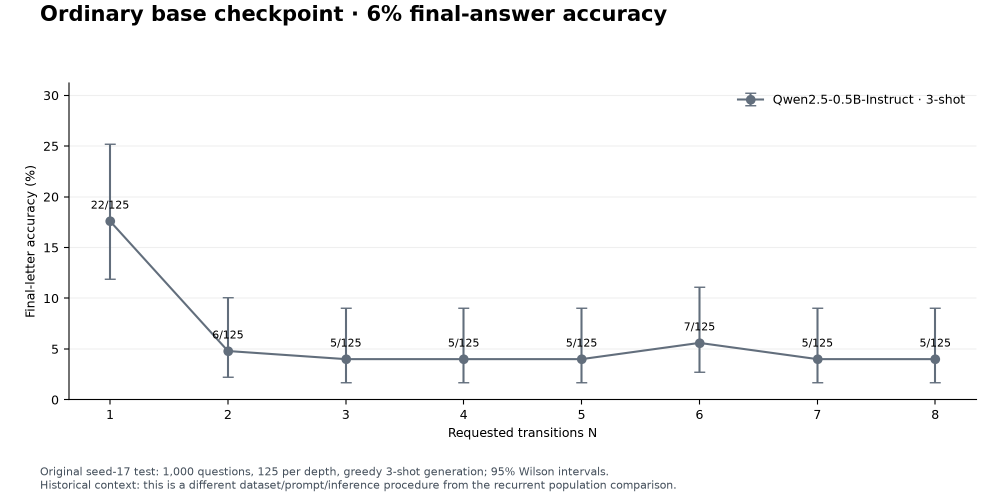

[PDF](06_writeup/baseline.pdf) · [SVG](06_writeup/baseline.svg)

## Attempt 1 · full-sequence intermediate supervision

Historical training: CE windows weight minibatch examples; validation cohorts weight questions.
Each run retains its original development data. Requested-count holdouts can still be supervised intermediate loops.

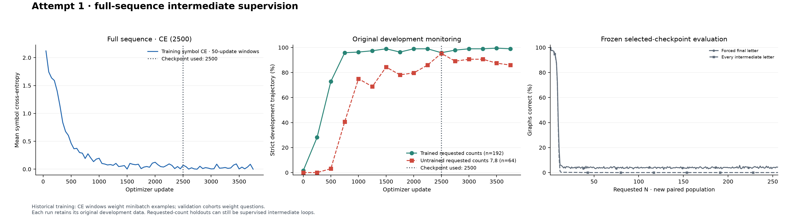

[PDF](06_writeup/attempt_01.pdf) · [SVG](06_writeup/attempt_01.svg)

## Attempt 2 · completion head and fixed prompt memory

Historical training: CE windows weight minibatch examples; validation cohorts weight questions.
Each run retains its original development data. Requested-count holdouts can still be supervised intermediate loops.

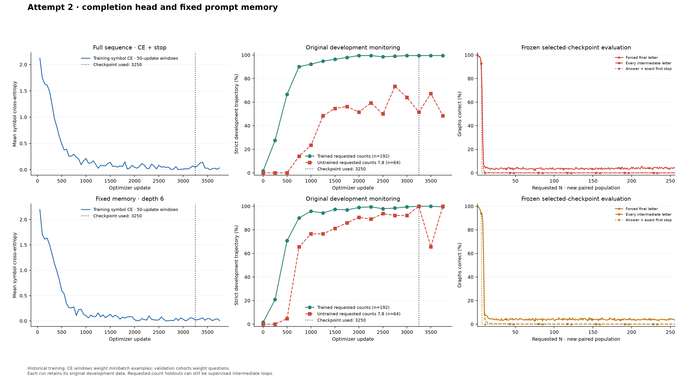

[PDF](06_writeup/attempt_02.pdf) · [SVG](06_writeup/attempt_02.svg)

## Attempt 3 · deeper training with the same architecture

Historical training: CE windows weight minibatch examples; validation cohorts weight questions.
Each run retains its original development data. Requested-count holdouts can still be supervised intermediate loops.

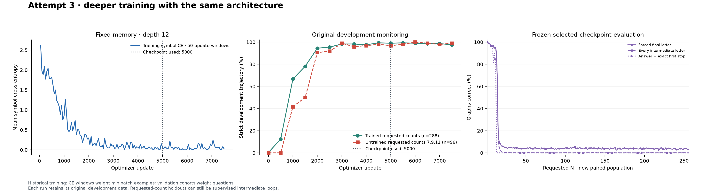

[PDF](06_writeup/attempt_03.pdf) · [SVG](06_writeup/attempt_03.svg)

## Attempt 4 · count-free executor and private controller

Successful R training shown here; later frozen-R GRU fitting is in controller_development.
Population evaluation uses the later GRU controller; the executor training controller was replaced.

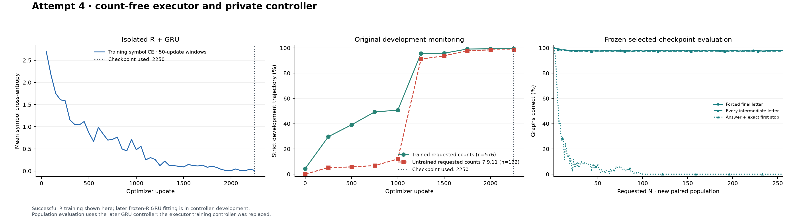

[PDF](06_writeup/attempt_04.pdf) · [SVG](06_writeup/attempt_04.svg)

## Attempt 5 · shared number reader and precise learned countdown

Left: earlier scalar-controller pilot. Middle: later separate fit on the same 58 requested counts and at most 12 labels per count.
Reader was fitted by least squares (maximum training-count error 3.8e-06); no reader/cell epoch history exists.

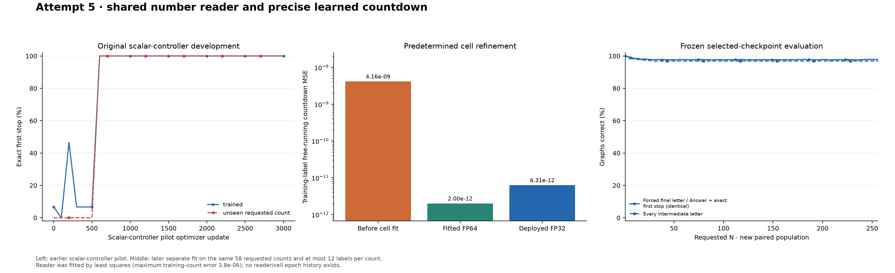

[PDF](06_writeup/attempt_05.pdf) · [SVG](06_writeup/attempt_05.svg)

## Ordinary Qwen · current full graph/count benchmark

Same 1,350 graphs, starts, rule order and requests 1–256 as the recurrent suite; 345,600 unconstrained generations.
Existing 3-shot chat prompt; greedy, max 8 new tokens. Invalid responses are failures. Prompt/readout differ from recurrent inference.
Pointwise intervals use 1,350 graphs; requests share graph clusters. Generation tokens are not recurrent transitions.

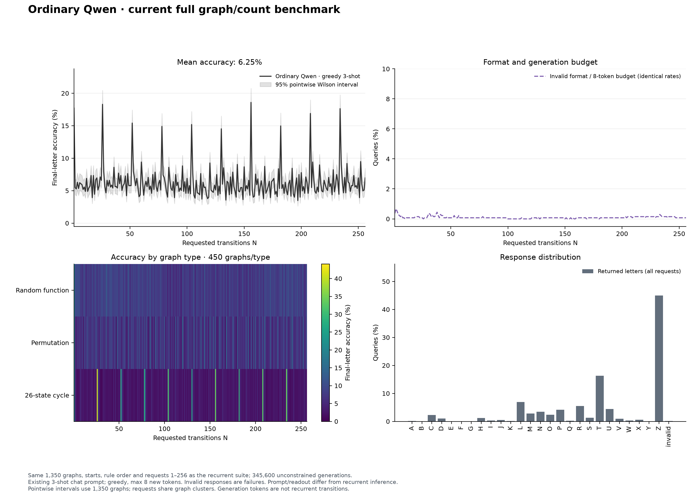

[PDF](06_writeup/matched_baseline.pdf) · [SVG](06_writeup/matched_baseline.svg)

## Execution and complete-solver quality

Each depth has 1,350 graphs. Headless CE has no learned-stop score. Shared-executor curves are drawn once.
CE uses selected step 2500; architecture, data, capacity and recipes differ, so these are descriptive comparisons.

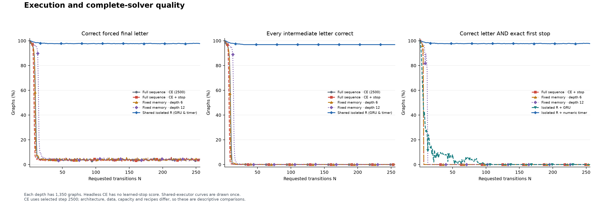

[PDF](01_quality/architecture_quality.pdf) · [SVG](01_quality/architecture_quality.svg)

## Quality at every requested depth

All integer depths 1–256 are shown. Blank cells mean undefined metrics, not zero accuracy.
Strict trajectory cannot recover after an earlier error; final-letter accuracy can.

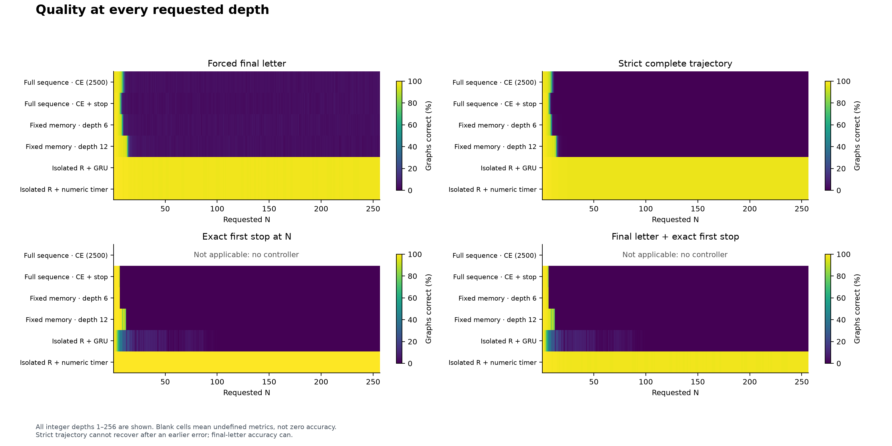

[PDF](01_quality/quality_matrices.pdf) · [SVG](01_quality/quality_matrices.svg)

## Final answers on identical questions · ordinary and recurrent

All models use the same 345,600 graph/count queries. Ordinary Qwen uses 3-shot chat generation; recurrent models use raw prompts/restricted readout.
Left: recurrent readout at N. Right: actual returned letter; correct letters at wrong loops count here, so this is NOT answer + exact-stop success.
No trajectory or loop-timing metric is assigned to ordinary generation. CE has no learned stop and is absent from the right panel.

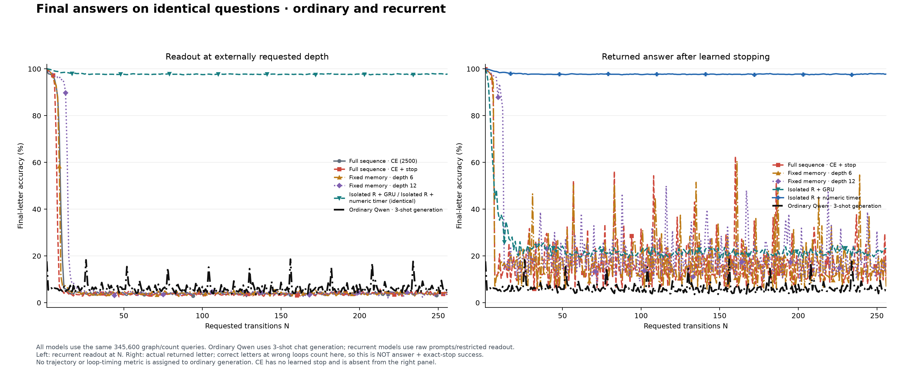

[PDF](01_quality/final_letter_comparison.pdf) · [SVG](01_quality/final_letter_comparison.svg)

## Where execution first fails, with the prompt held fixed

Survival denominator is always all 1,350 graphs for each fixed N. A first error ends survival permanently.
These curves do not compare different requested counts as though they were one rollout.

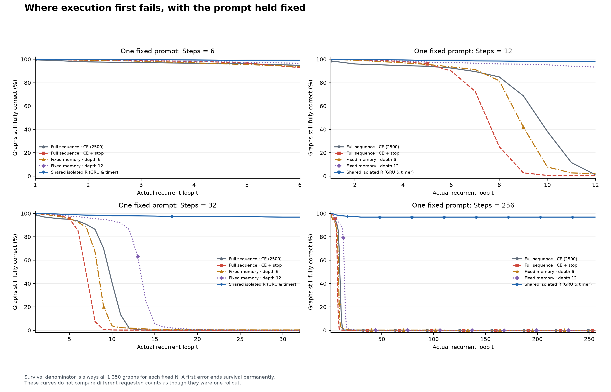

[PDF](02_execution/first_error_survival.pdf) · [SVG](02_execution/first_error_survival.svg)

## Conditional first-error hazard

Only graphs correct before loop t enter its risk set. Blank: beyond requested N or an empty risk set.
Zero hazard remains a measured zero; raw at-risk denominators are in fixed_request_loops.csv.

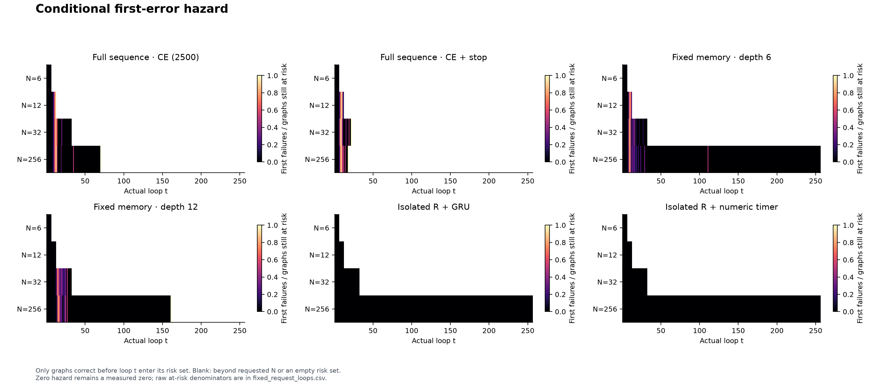

[PDF](02_execution/first_error_hazard.pdf) · [SVG](02_execution/first_error_hazard.svg)

## Mutually exclusive first-error types

Each failed graph contributes once per fixed requested depth. Priority: previous → earlier visited → later reachable → outside orbit.
These describe decoded letters, not a causal explanation of latent-state mechanics.

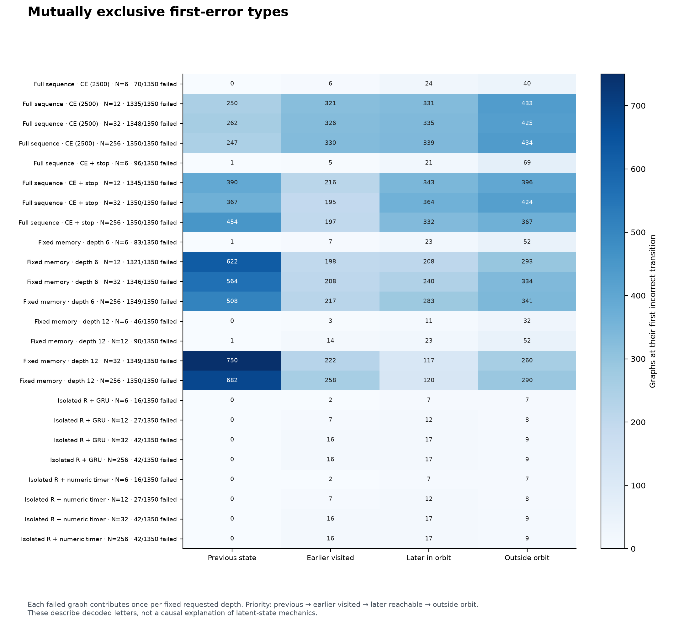

[PDF](02_execution/first_error_taxonomy.pdf) · [SVG](02_execution/first_error_taxonomy.svg)

## Which graph structures break each executor?

Rates and graph denominators appear in every observed cell. Empty bins are N/A. Full cycles have period 26 by construction.
Cycle period is compared within graph mode; these associations cannot isolate a causal graph feature.

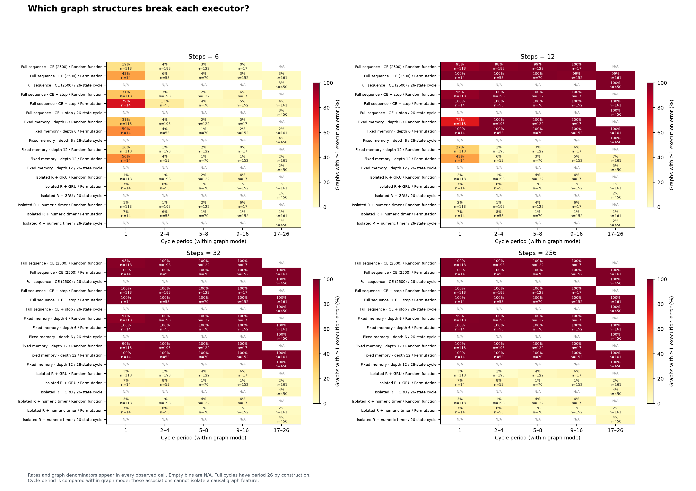

[PDF](03_structure/cycle_strata.pdf) · [SVG](03_structure/cycle_strata.svg)

## Final executor failures by mode, seed and transient

All 1,350 graphs, one binary trajectory outcome per graph at N=256. Pointwise graph-level intervals.
Transient bins mix graph modes and are descriptive; within-mode strata and secondary risk exposures are saved as tables.

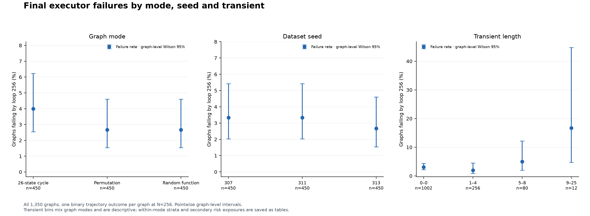

[PDF](03_structure/final_strata.pdf) · [SVG](03_structure/final_strata.svg)

## All final-executor failing trajectories

42 graphs fail; 1,308 graphs correct throughout are omitted. λ = cycle period; μ = transient length.
A later correct letter can recover final-answer accuracy, but cannot erase an earlier trajectory failure.

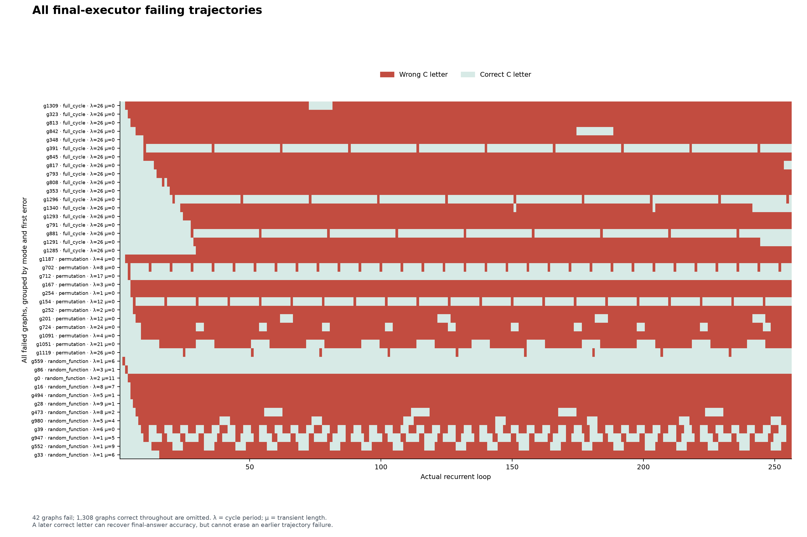

[PDF](03_structure/final_failed_trajectories.pdf) · [SVG](03_structure/final_failed_trajectories.svg)

## Requested versus actual stopping loops

Every requested row contains 1,350 graphs. Missing means no crossing by cap 272; it is a separate bin.
The diagonal corresponds to exact completion. Blank cells contain zero observations.

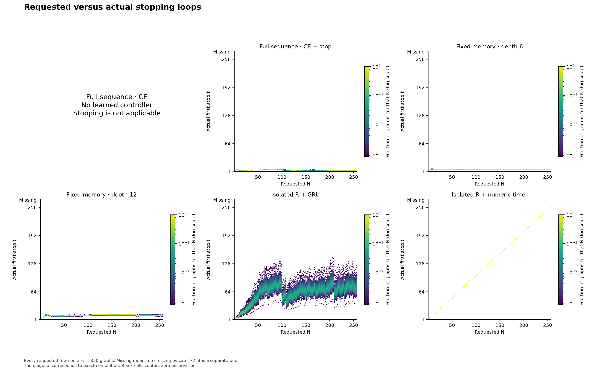

[PDF](04_stopping/requested_actual_stops.pdf) · [SVG](04_stopping/requested_actual_stops.svg)

## How learned stopping fails

Exact, early, late and missing are mutually exclusive and sum to 100% at each N.
A correct letter at the wrong loop is still a timing failure, including cyclic coincidences.

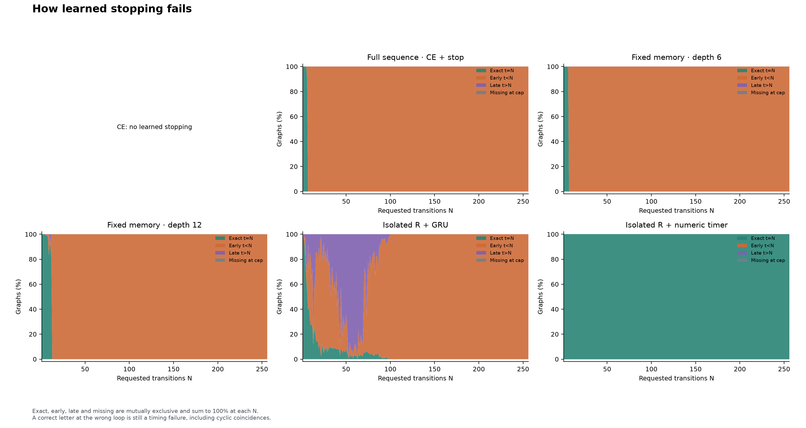

[PDF](04_stopping/timing_failure_modes.pdf) · [SVG](04_stopping/timing_failure_modes.svg)

## Execution and timing failures are separate problems

Execution here means the forced letter at requested N, not strict trajectory correctness.
Timing is the first crossing at N. These four exclusive outcomes distinguish execution failure from controller failure.

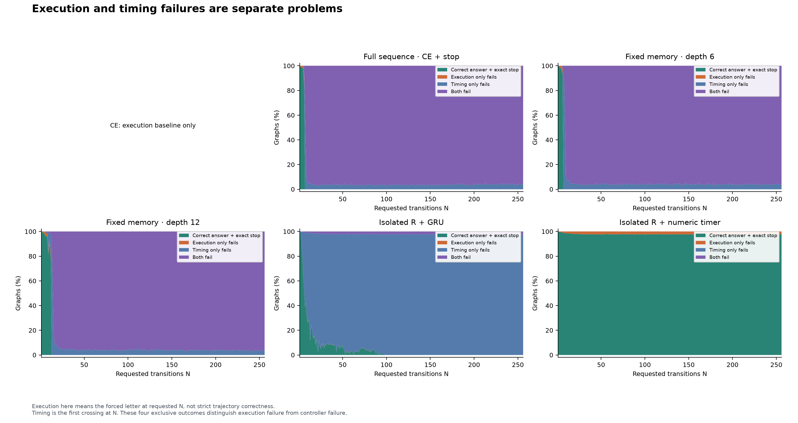

[PDF](04_stopping/execution_timing_decomposition.pdf) · [SVG](04_stopping/execution_timing_decomposition.svg)

## Timing errors and misleading correct letters

Missing crossings are excluded from residual quantiles and retained in the timing-category plot.
Right panel uses all graphs: cyclic coincidences never count as joint success.

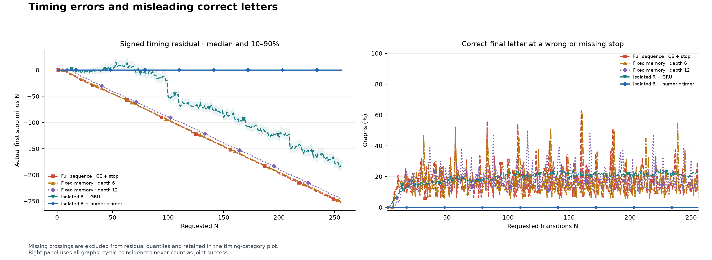

[PDF](04_stopping/stop_residuals_and_coincidences.pdf) · [SVG](04_stopping/stop_residuals_and_coincidences.svg)

## How the successful executor learned

Fixed 768-query development monitoring from the original run. Each loop has its own eligible denominator.
Step 1000 has monitoring records but no retained weights. This is executor development, not a solver checkpoint-selection curve.

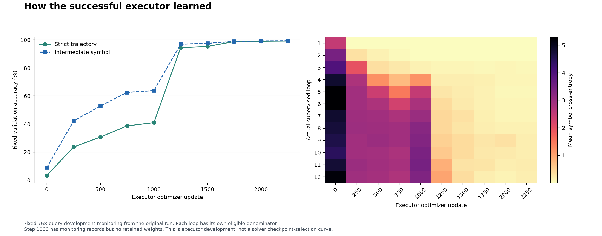

[PDF](05_learning/executor_validation_learning.pdf) · [SVG](05_learning/executor_validation_learning.svg)

## Long-range execution across retained successful-architecture snapshots

Same 1,350 graphs, frozen executor snapshots; N is hidden from R. Final exact timer composition would inherit final-letter quality.
These are diagnostic compositions, not historical autonomous solvers. Missing step-1000 weights are not interpolated.

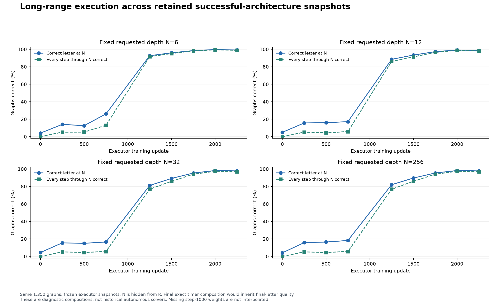

[PDF](05_learning/executor_population_progression.pdf) · [SVG](05_learning/executor_population_progression.svg)

## Frozen-executor GRU controller development

Original controller-development cohorts, not the 1,350-graph paper panel. Cohort definitions are in controller_repair.md.
Reader and scalar-cell repair are later distinct fits; their numeric validation is tabulated separately, never spliced into this learning curve.

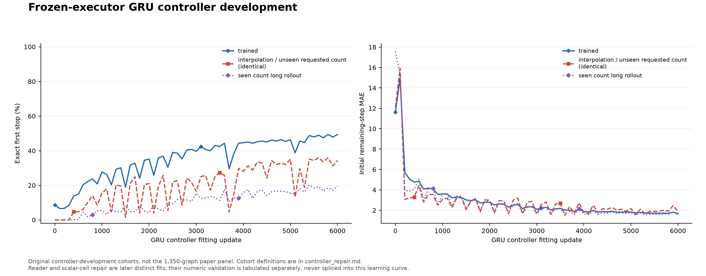

[PDF](05_learning/controller_development.pdf) · [SVG](05_learning/controller_development.svg)

## Answer-and-stop quality versus recurrent budget

Frozen policies on the same graphs/counts; 95% paired graph-cluster intervals. Missing stops cost all 272 passes.
Loops are a logical budget, not FLOPs/latency; block costs differ. CE-only stopping is undefined and excluded.
Exact ties are drawn once with policy names. Frontier is among observed point estimates; no threshold fitting or interpolated policy.

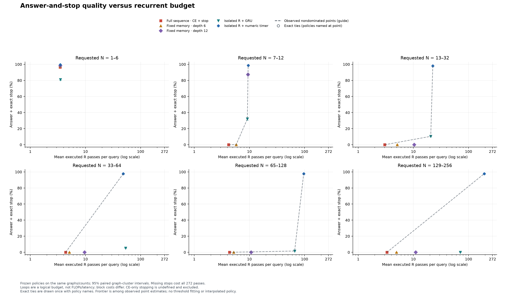

[PDF](07_compute/pareto_joint_success.pdf) · [SVG](07_compute/pareto_joint_success.svg)

## Strict execution-and-stop quality versus recurrent budget

Frozen policies on the same graphs/counts; 95% paired graph-cluster intervals. Missing stops cost all 272 passes.
Loops are a logical budget, not FLOPs/latency; block costs differ. CE-only stopping is undefined and excluded.
Exact ties are drawn once with policy names. Frontier is among observed point estimates; no threshold fitting or interpolated policy.

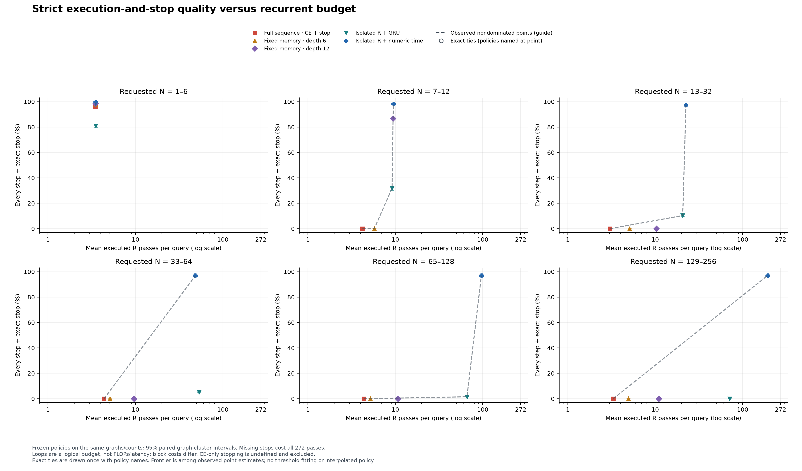

[PDF](07_compute/pareto_strict_success.pdf) · [SVG](07_compute/pareto_strict_success.svg)
