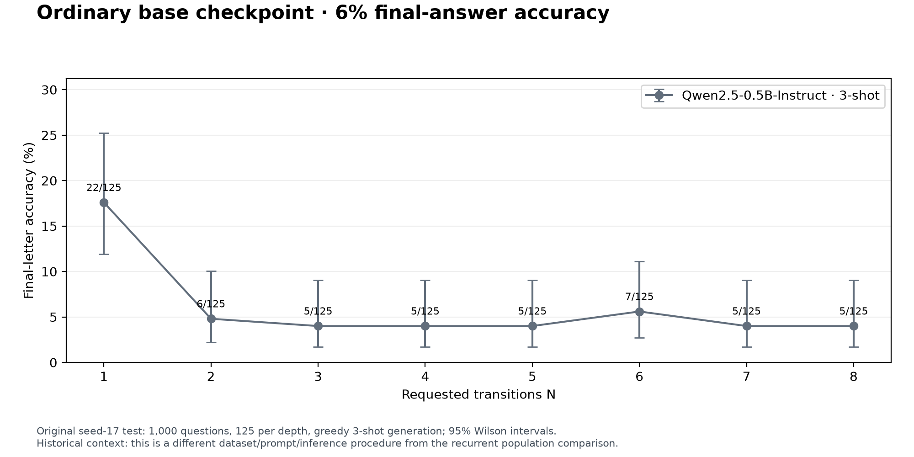
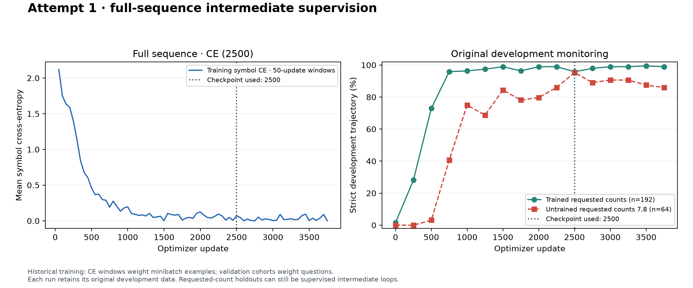
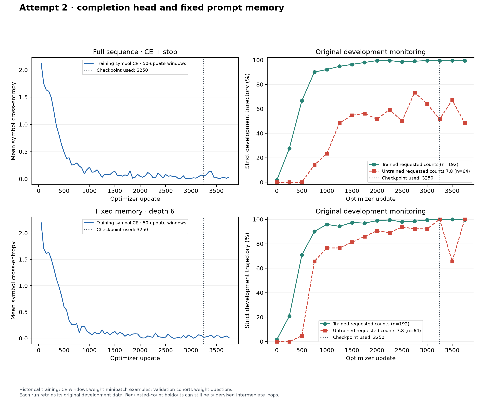
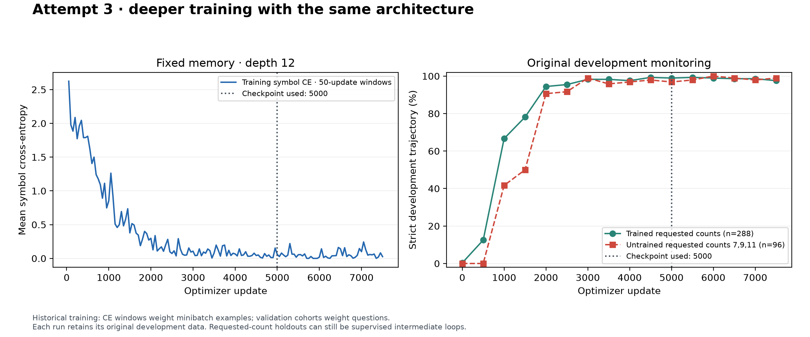
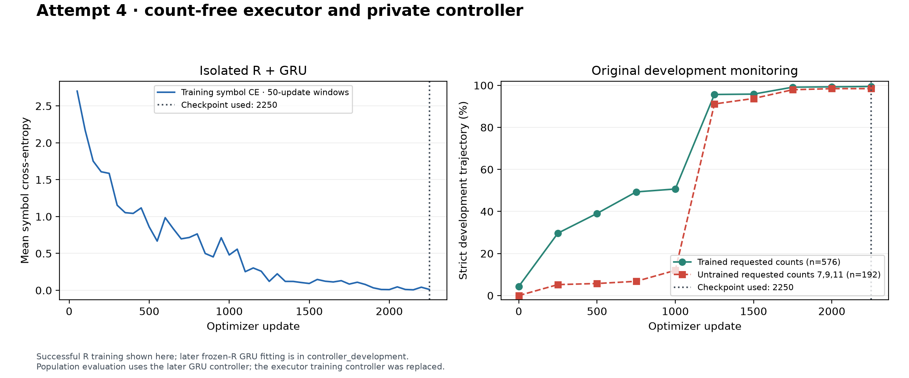
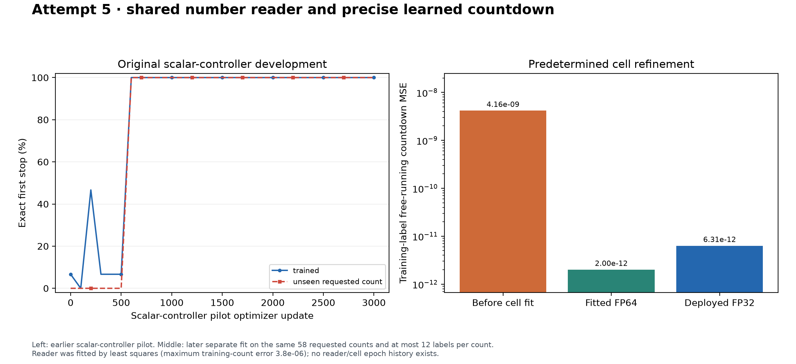

# Saved writeup histories

Actual original baseline/training evidence. Full-population evaluation panels will be included in the final paper bundle after its audit.

## Ordinary base checkpoint · 6% final-answer accuracy

Original seed-17 test: 1,000 questions, 125 per depth, greedy 3-shot generation; 95% Wilson intervals.
Historical context: this is a different dataset/prompt/inference procedure from the recurrent population comparison.

## Attempt 1 · full-sequence intermediate supervision

Historical training: CE windows weight minibatch examples; validation cohorts weight questions.
Each run retains its original development data. Requested-count holdouts can still be supervised intermediate loops.

## Attempt 2 · completion head and fixed prompt memory

Historical training: CE windows weight minibatch examples; validation cohorts weight questions.
Each run retains its original development data. Requested-count holdouts can still be supervised intermediate loops.

## Attempt 3 · deeper training with the same architecture

Historical training: CE windows weight minibatch examples; validation cohorts weight questions.
Each run retains its original development data. Requested-count holdouts can still be supervised intermediate loops.

## Attempt 4 · count-free executor and private controller

Successful R training shown here; later frozen-R GRU fitting is in controller_development.
Population evaluation uses the later GRU controller; the executor training controller was replaced.

## Attempt 5 · shared number reader and precise learned countdown

Left: earlier scalar-controller pilot. Middle: later separate fit on the same 58 requested counts and at most 12 labels per count.
Reader was fitted by least squares (maximum training-count error 3.8e-06); no reader/cell epoch history exists.

